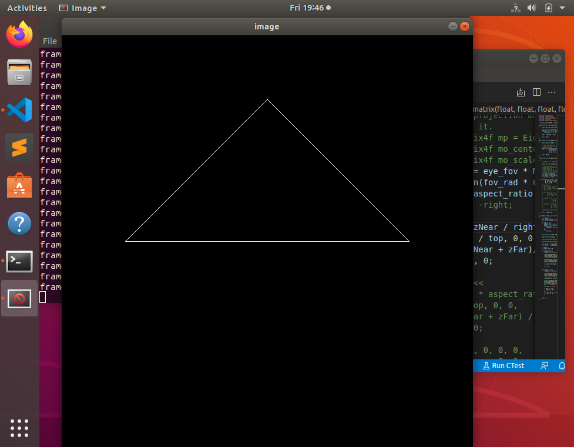

# 作业1 旋转与投影
## 模型变换矩阵
逐个元素地构建模型变换矩阵并返回该矩阵。在此函数中，你只需要实现三维中绕z 轴旋转的变换矩阵，而不用处理平移与缩放。

内置函数的返回值是弧度，要先把角度换成弧度
> 弧度=角度*pi/180

```c++
Eigen::Matrix4f get_model_matrix(float rotation_angle)
{
    Eigen::Matrix4f model = Eigen::Matrix4f::Identity();
    
    // TODO: Implement this function
    // Create the model matrix for rotating the triangle around the Z axis.
    // Then return it.
    model << cos(rotation_angle * MY_PI / 180), -sin(rotation_angle * MY_PI / 180), 0, 0,
                 sin(rotation_angle * MY_PI / 180), cos(rotation_angle * MY_PI / 180), 0, 0,
                 0, 0, 1, 0,
                 0, 0, 0, 1;
      
    return model;
}
```
## 构建透视投影矩阵
根据链接：http://www.songho.ca/opengl/gl_projectionmatrix.html 已知，openGL下投影矩阵为
$\begin{bmatrix} \frac {2n}{r-l} & 0 & \frac {r+l}{r-l} & 0 \\ 0 & \frac {2n}{t-b} & \frac {t+b}{t-b} & 0\\ 0 & 0 & \frac {n+f}{n-f} & \frac {2nf}{n-f} \\ 0 & 0 & -1 & 0 \end{bmatrix}$

已知宽高比，隐含假设对称条件，l = -r, b = -t
```c++
Eigen::Matrix4f get_projection_matrix(float eye_fov, float aspect_ratio,float zNear, float zFar)
{
    // Students will implement this function

    Eigen::Matrix4f projection = Eigen::Matrix4f::Identity();

    // TODO: Implement this function
    // Create the projection matrix for the given parameters.
    // Then return it.

    float fov_rad = eye_fov * MY_PI / 180;
    float top = tan(fov_rad * 0.5) * zNear;
    float right = aspect_ratio * top;

    projection << zNear / right, 0, 0, 0,
          0, zNear / top, 0, 0,
          0, 0, (zNear + zFar)/(zNear - zFar), 2 * zNear * zFar /(zNear - zFar),
          0, 0, -1, 0;

    return projection;
}
```

## 结果




旋转后的结果


